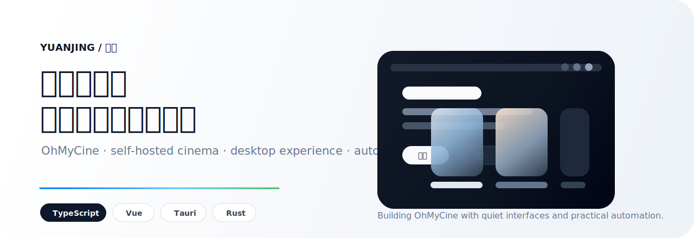

  

 

<h3 align="center">你好，我是 YuanJing</h3>

  我在做一些自己真正会用的东西：家庭影音、自动化、桌面体验，以及那些应该安静待在背景里的工具。

  现在主要精力在 <strong><a href="https://github.com/yuanjing-hash/OhMyCine">OhMyCine</a></strong>，一套开源、自托管、跨平台的家庭影院生态。

  
  
  

---

### 正在做

 

**[OhMyCine](https://github.com/yuanjing-hash/OhMyCine)** 是一个开源、全平台、自托管的家庭影院生态。 
我希望它不像“又一个媒体管理后台”，而是更接近一件可以长期放在家里用的私人影院工具。

当前重点是 **Player**：基于 `Tauri` + `Vue 3` + `TypeScript` + `libmpv` 的桌面播放器，支持 Emby / OpenList / Alist 数据源、本地只读刮削、TMDB 元数据增强和 Cinema OS 风格界面。

  
  
  

### 我喜欢的技术感

`TypeScript` · `Vue` · `Vite` · `Tauri` · `Rust` · `Python` · `Node.js` · `Git`

我喜欢工具有一点完成度：界面少解释、路径短一点、状态清楚一点，能自动做的事情就不要让人反复点。

### 现在的状态

- 把 **OhMyCine Player** 打磨成一个真正顺手的私人影院桌面应用。
- 继续完善媒体源、刮削、元数据、播放历史和凭据边界。
- 主页只展示真正值得长期维护的项目。

  
<strong>English Version</strong>

### Hi, I'm YuanJing

I build tools I actually want to live with: private cinema systems, automation, desktop apps, and quiet software that stays out of the way.

Most of my current work goes into **[OhMyCine](https://github.com/yuanjing-hash/OhMyCine)**, an open-source, cross-platform, self-hosted home cinema ecosystem.

**OhMyCine Player** is a Tauri + Vue + TypeScript desktop app powered by libmpv. It connects to Emby, OpenList and Alist, supports local read-only scraping, TMDB metadata enrichment, playback history, and a Cinema OS style interface.

I care about interfaces that feel calm, useful, and finished.

 

  南京 · building slowly, shipping honestly

